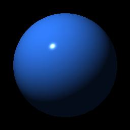

# RTracer

[](https://github.com/guydunton/rtracer/actions)
[](https://opensource.org/licenses/MIT)

A ray tracer build in Rust from the excellent book "The Ray Tracer Challenge" by Jamis Buck ([Link](https://pragprog.com/titles/jbtracer/)).

Currently the project will output a static image (out.png) when ran like the one below.



## Build, Run & Test

The project just uses Cargo to build & run:

```bash
cargo build
cargo run
cargo test
```

## Tests

The project has built in tests using my testing framework [rust-catch](https://github.com/guydunton/rust-catch).
