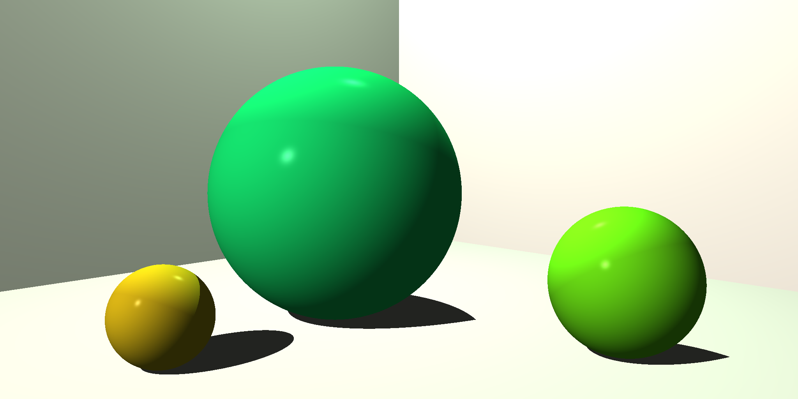
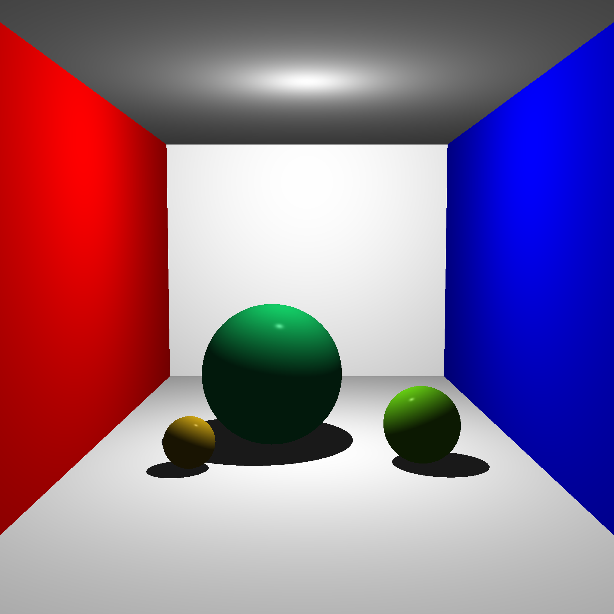

# RTracer

[](https://github.com/guydunton/rtracer/actions)
[](https://opensource.org/licenses/MIT)

A ray tracer build in Rust from the excellent book "The Ray Tracer Challenge" by Jamis Buck ([Link](https://pragprog.com/titles/jbtracer/)).

The project renders a static scene like the one below. When rendering is complete the scene is saved as a `out.png` into the working directory:


See [below](#results-of-each-chapter) for the results at the end of each chapter.

## Build, Run & Test

The project just uses Cargo to build & run:

```bash
cargo build # Build the code in debug mode
cargo run   # Run the code
cargo test  # Run the unit tests
```

## Results of each chapter

| Chapter | Description                                    | Image                                                                   |
| ------- | ---------------------------------------------- | ----------------------------------------------------------------------- |
| 1 - 4   | Background maths for tuples, matrices & colors | N/A                                                                     |
| 5       | Flat color rendering                           |  |
| 6       | Add lighting and shading                       |  |
| 7       | Creating a complex scene from spheres          |  |
| 8       | Adding shadows                                 |  |
| 9       | Adding planes for the background               |  |
